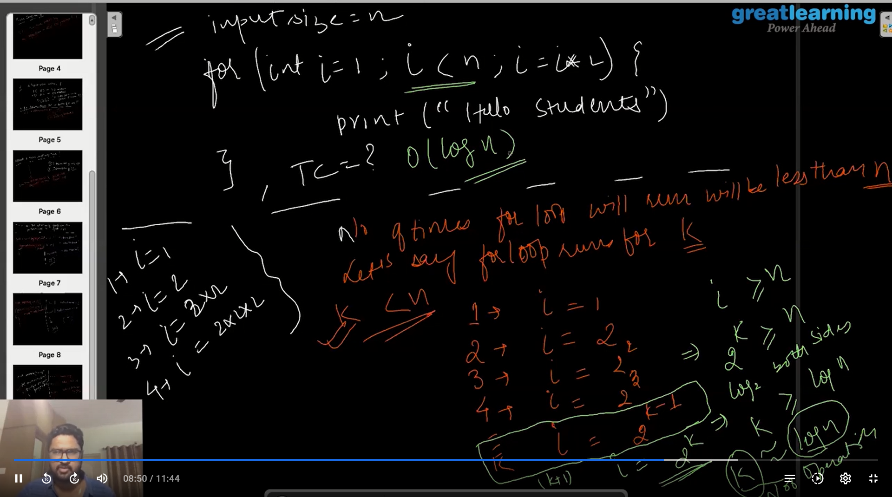

## Data Structure

# what ?


# why ?

```
>  arrange data for efficient storage

> fast query

> Processing Speed

> Reusability

>

```

#  Time complexity

```
gd: how the actual number of operations are proportional to the input size ? linear, constant

worse case

```
> log() complexit/ example

<p align="center">
    
</p>