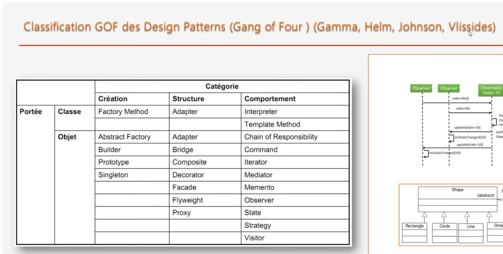

# Design Pattern

```


+sieurs regroupé en 03 types :
> création,
> structure
> comportement

```
# types

> Création

```
description de la manière dont les objets sont crées , initialisés et configurés

abstract factory, singleton, Builder, prototype

```


> Structure

```
description de la manière dont les objets de l'app doivent etre connectés afin de rendre ces connections indépendantes des evolutions futures.

-u diagramme class

ex: adapter, decorateur, composite

```

> Comportement

```
description des comportements des interactions entre objets. dynamique du systemes

Strategy, Observer, Iterator


-u d classe + d de sequence

```

# portée du DP

```
02 manières de reutilisé les classes:

instaciation (relation entre objets) et heritage (relation entre classe)

```

> portée de classe, reutilisation par heritage


> Portée Instance, reutilisation par composition /instanciation

# classification GOF

<p align="center">
    
</p>

```
une classification de 23 design patterns. les autres s'appuient sur ces derniers.

```