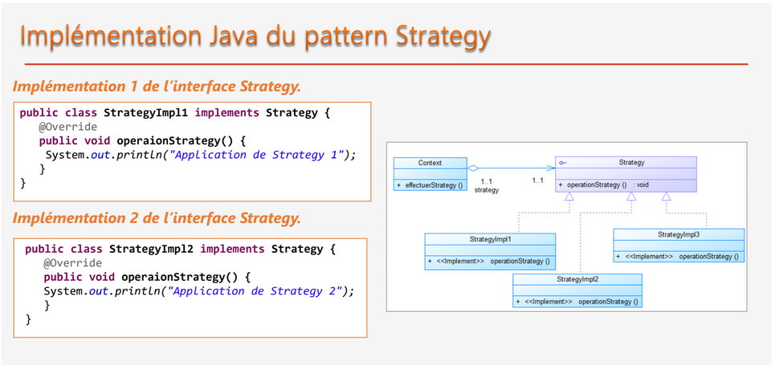
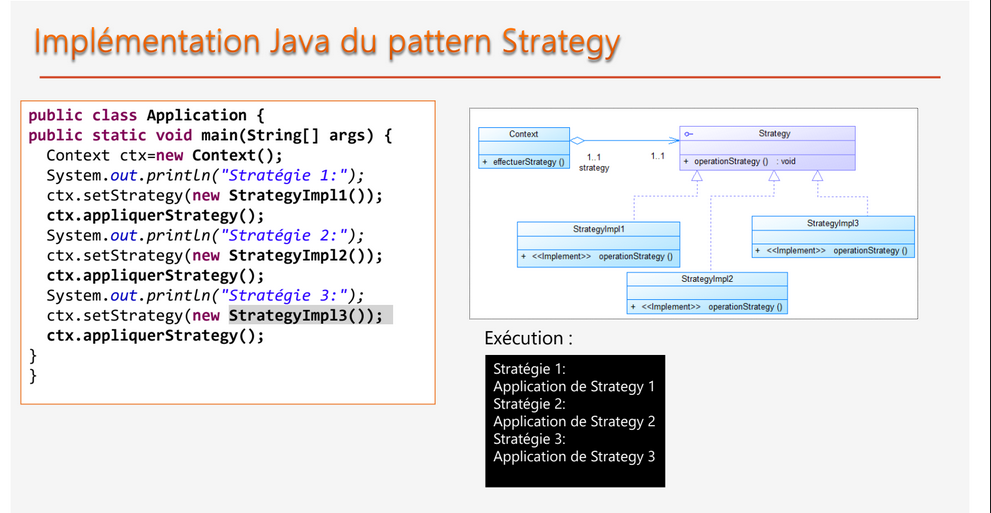

# Pattern Strategy

# Categorie : 
```
Comportement

1 seul fction/ interface

```


# objectifs
```
Définir une famille d’algorithmes, et encapsuler
chacun et les rendre interchangeables tout en
assurant que chaque algorithme puisse évoluer
indépendamment des clients qui l’utilisent.

```

# Raison d'utilisation
```
un objet doit pouvoir varier une partie de son algorithme dynamiquement.

```


# Objectifs
```
permet d'isoler les algorithmes
appartenant à une même famille d'algorithmes.

```

# Implementation

<p align="center">
    
</p>

<br>
<p align="center">
    
</p>